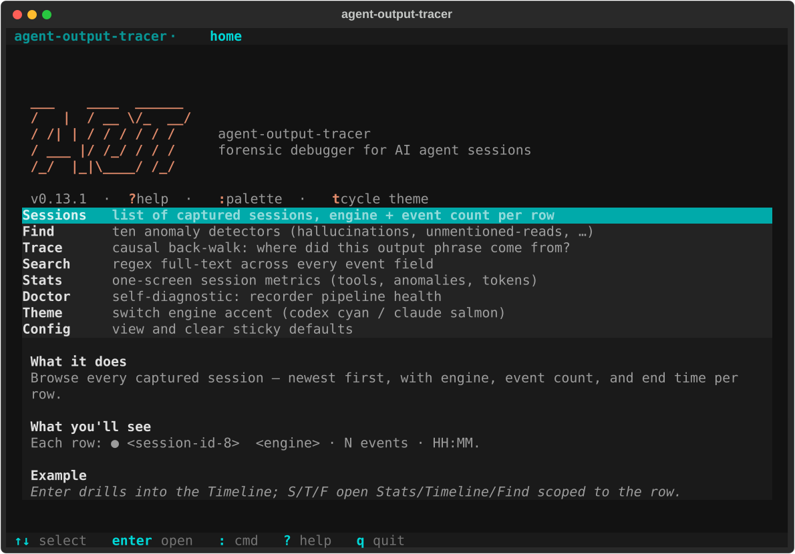

# agent-output-tracer

[](https://github.com/itosdad/agent-output-tracer/actions/workflows/test.yml)
[](https://github.com/itosdad/agent-output-tracer/actions/workflows/lint.yml)
[](https://github.com/itosdad/agent-output-tracer/releases)
[](LICENSE)
[](https://www.python.org)

> **Forensic debugger for AI agent sessions.**
> Records every Claude Code / Codex CLI turn via hooks, then lets you replay,
> trace, and query what the agent actually did when its output looks wrong.

<p align="center">
  
</p>

The plugin captures every event silently in the background. When something
in an agent's output looks off — a fact you never mentioned, a path that
shouldn't have been touched, a conclusion that doesn't match what was read
— you open the **`aot tui`** side-channel inspector and walk through the
session in chronological order, with byte counts, tool inputs, and
read-byte hashes intact.

The tool is **observation-only** (hooks never block the agent), **engine-
agnostic** (Claude Code and Codex CLI normalise to the same schema), and
**user-driven** (no proactive alerts; you decide when something needs
investigation).

---

## TUI in 60 seconds

```bash
# 1. Install the plugin in your engine (records sessions to ~/.claude/plugins/data)
#    Claude Code:  /plugin marketplace add itosdad/agent-output-tracer
#                  /plugin install agent-output-tracer@itosdad-agent-output-tracer
#    Codex CLI:    see docs/INSTALL.md

# 2. Install the CLI + TUI extra
pipx install "agent-output-tracer[tui]"

# 3. Run any agent session, then launch the inspector
aot tui                       # latest session
aot tui --session <prefix>    # specific session
```

The TUI auto-detects which engine you're inside (`CLAUDE_PLUGIN_DATA` vs
`CODEX_PLUGIN_DATA`) and themes itself accordingly — cyan for Codex, salmon
for Claude Code. Press `t` to toggle, `?` for help.

---

## Screens

### Home — function picker with live preview

<table>
<tr>
<td></td>
<td></td>
</tr>
</table>

`↑↓` steps through Sessions / Find / Trace / Search / Stats / Doctor /
Theme / Config. The preview pane below each row explains what the function
does, what data it'll show, and one concrete example so you know what
you're picking before you drill in.

### Sessions — list of captures with detail-pane

<p align="center">
  
</p>

Newest first. The pane below shows the highlighted session's engine,
span, cwd, event count, prompt mix, byte total, top tools, and anomaly
counters — read straight from `metadata.json`, no extra event scan.

Session-scoped shortcuts: `S` Stats · `T` Timeline · `F` Find · `e` Export.

### Timeline — event-by-event drill in

<p align="center">
  
</p>

Each event is a two-line card with a semantic prefix:

| Glyph | Event | When |
|:---:|---|---|
| `›`  | user_prompt | the operator said something |
| `⏵`  | pre_tool | agent is about to call a tool |
| `✓`  | post_tool | tool returned (response + bytes) |
| `•`  | agent_response | agent emitted its reply |
| `─`  | session_start / end / compact | bookkeeping |

`o` toggles `tail -f` mode — the cursor rides the newest row, the
StatusBar shimmers `●` ↔ `○` while polling. Enter on any event drills
into Event Detail. `y` yanks the highlighted row to the clipboard.

### Event Detail — full structured event

<p align="center">
  
</p>

Pretty-printed structured payload with tool input, tool response (or
agent_response_text), paths, bytes, and the raw engine event preserved
verbatim. `y` yanks the event as JSON; `n` attaches a note.

### Find — ten anomaly detectors

<p align="center">
  
</p>

<p align="center">
  
</p>

`hallucinations`, `unmentioned-reads`, `repeated-reads`, `glob-burst`,
`routing-thrash`, `large-read`, `empty-glob`, `stale-cache`,
`silent-failure`, `abandoned-write` — each ships with a default threshold
overridable via the `:` command palette (`:find repeated-reads 5`).
Enter on a match opens the source event.

### Doctor — recorder pipeline self-diagnostic

<p align="center">
  
</p>

`runtime` / `data_dir` / `recent_sessions` / `hooks_wiring` — each
labelled `✓` / `⚠` / `✗` against the active theme's success / warning /
error palette. If anything is wrong, the `fix:` line tells you what to do.

---

## Key bindings (cheat sheet)

Universal — available on every screen:

| Key | Action |
|---|---|
| `↑` `↓` | navigate |
| `g` `G` (or `Home` `End`) | first / last row |
| `Enter` | open the highlighted item |
| `Esc` | back |
| `:` | command palette |
| `?` (or `F1`) | help overlay (any key closes) |
| `t` | cycle theme (codex ↔ claude) |
| `y` | yank highlighted payload to the clipboard |
| `q` | quit |

Screen-specific shortcuts are listed inline in the per-screen footer
and in the help overlay (`?`).

Native terminal text selection (Option-drag on iTerm2 / Terminal.app,
Shift-drag on Linux) still works — the TUI's mouse capture is off
for `y`-targeted regions.

---

## CLI quick reference

The CLI is the scriptable surface; the TUI calls the same queries
internally so everything you see in the TUI you can pipe into a shell.

```bash
aot list --last 10               # 10 most recent sessions
aot latest                       # just the most-recent session id
aot doctor                       # recorder pipeline self-check

aot replay --session latest                # full timeline as text
aot replay --session latest --show-hints   # + anomaly hints
aot replay --session a3f2 --format json    # JSON for scripts

aot stats --session latest                 # per-session metrics
aot find hallucinations --session latest   # any of the 10 detectors
aot grep --session latest --pattern "JWT|token" -i

aot trace --session latest --output "PHRASE"      # walk back to first source
aot why   --session latest --path /proj/foo.md    # why did this fire?
aot diff  --session latest                        # user-asked vs agent-touched

aot tail   --session latest                       # tail -f events.jsonl
aot tail   --session latest --format stream-json  # NDJSON pipe
aot export --session latest --format markdown     # safe-share (redacted)
```

Session specs accept the full UUID, any unique ≥ 4-char prefix,
`latest`, `latest-N`, or `YYYY-MM-DD`. All commands surface JSON via
`--format json` for piping into `jq`.

Full CLI reference: [`docs/INSTALL.md`](docs/INSTALL.md) and `aot --help`.

---

## What gets recorded

Per session, under `${CLAUDE_PLUGIN_DATA}/sessions/<session_id>/`:

| File | Content |
|---|---|
| `events.jsonl` | One JSON line per event — `user_prompt` / `pre_tool` / `post_tool` / `agent_response` / `session_end` (+ Codex `session_start` / `compact_pre` / `compact_post`) |
| `metadata.json` | Running counters: tool calls, unique files read, total bytes, `ts_start` / `ts_end`, anomaly counters, tool mix. Rewritten on every appended event |

Both engines normalise into the same schema, so a single `aot` query
works regardless of which engine produced the session.

Default secret patterns (OpenAI / Anthropic API keys, GitHub PATs, AWS
access keys, JWT, common `password=` / `token=` / `secret=` shapes) are
masked before write.

---

## Safety properties

| Concern | How the plugin handles it |
|---|---|
| Hooks could block the agent | Every hook exits 0 unconditionally. JSON parse errors, recorder failures, redactor crashes — all swallowed |
| Host repo could get polluted | Writes only to `${CLAUDE_PLUGIN_DATA}` (per engine). Never touches `<repo>/.claude/` or `<repo>/tasks/` |
| Secrets could leak into events.jsonl | `core/redactor.py` masks 7 common formats by default. Custom patterns via `aot config` |
| Disk could grow forever | `aot gc` strips content fields after 30 days, deletes session dirs after 365 days (configurable). Run on demand or from cron |
| Old captures break a new reader | events.jsonl is append-only and versioned (`v` field). Schema additions stay forward/backward compatible |

---

## Status

| Phase | Scope | Status |
|---|---|---|
| A — capture pipeline | 5 hooks → adapter → recorder, redactor, `replay` / `list` / `grep` / `state-at` | ✅ |
| B — forensic queries | `trace` / `why` / `diff` / `mentioned-but-not-read` / `causal-graph` / `export-trace` / anomaly hints / `gc` | ✅ |
| C — Codex CLI support | `adapters/codex.py`, dual-engine hooks, install docs | ✅ |
| D-1..D-7 — UX foundation, schema v2, causal core, live tail, `aot tui`, bridges, safe-share export | base TUI + all forensic verbs | ✅ |
| TUI 1 — screen-based navigation | Home → Sessions → Timeline → Event Detail | ✅ |
| TUI 2 — power features | Help / Stats / Doctor / Find / Trace / Search / Note / Export / `:` palette / live follow | ✅ |
| TUI 3 — engine identity | Two themes (codex / claude), auto-detect, sticky defaults, S/T/F sub-actions, visual polish | ✅ |
| TUI 4.A — bug sweep + UX foundation | Theme override fix, menu preview pane, `y` yank, formal display name, OhMyZsh-style banner | ✅ |
| **TUI 4.B** — Diagnostic Brief | one-screen executive summary per session (verdict, top anomalies, hot files, sparkline) | 🔜 next |
| TUI 4.C — Context Reconstruction | "what did the agent actually see when it answered X?" view | 🔜 |
| TUI 4.D — Cross-session compare | diff two sessions, surface recurring anomalies | 🔜 |

See [`CHANGELOG.md`](CHANGELOG.md) for the per-version diff.

---

## Documentation

| Doc | What's in it |
|---|---|
| [`docs/INSTALL.md`](docs/INSTALL.md) | Plugin install (Claude Code marketplace + Codex), CLI install (pipx / pip), `[tui]` extra, env vars, troubleshooting |
| [`docs/TUI.md`](docs/TUI.md) | Comprehensive TUI guide: every screen, every keybind, theme system, follow mode, sticky defaults, clipboard yank |
| [`docs/DESIGN.md`](docs/DESIGN.md) | Original Phase A–C design (historical baseline) — recorder pipeline, hook contract, event schema |
| [`docs/DESIGN_FORENSIC_UX.md`](docs/DESIGN_FORENSIC_UX.md) | Original Phase D design (historical baseline) — forensic verbs, TUI vision |
| [`docs/OBSERVATIONS.md`](docs/OBSERVATIONS.md) | Empirical findings log — bugs caught in the wild, real-world capture data |
| [`CHANGELOG.md`](CHANGELOG.md) | Per-version diff |

---

## Contributing

See [`CONTRIBUTING.md`](CONTRIBUTING.md) for dev setup, scope guardrails,
and PR workflow. The project follows the
[Contributor Covenant](CODE_OF_CONDUCT.md) Code of Conduct.

### Regenerating screenshots

The README screenshots in `docs/img/` are generated programmatically:

```bash
python tools/capture_screenshots.py --out docs/img
```

The script seeds a tiny synthetic session, walks the TUI under Textual's
Pilot harness, and writes one SVG per (screen × theme). Re-run after any
TUI layout change.

## License

MIT — see [`LICENSE`](LICENSE).
