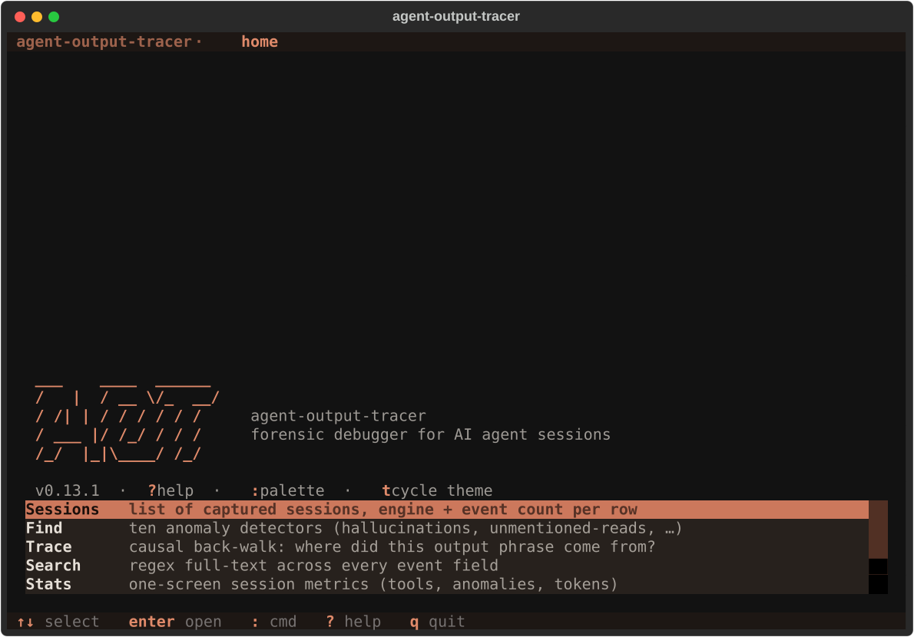
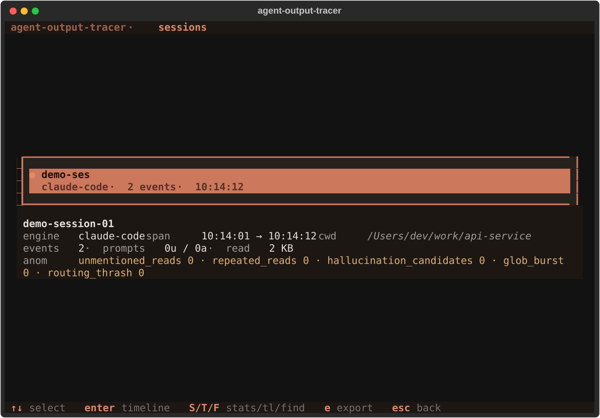
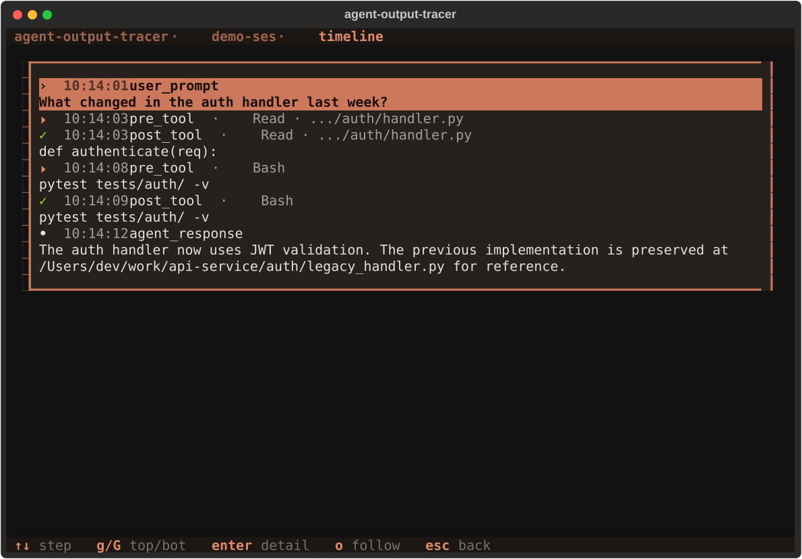
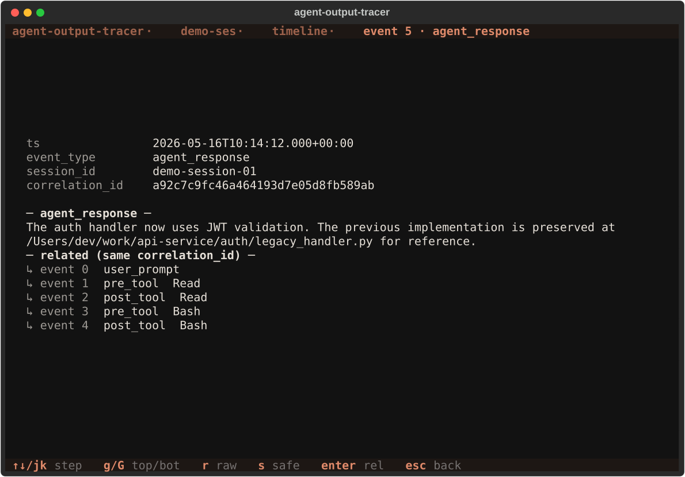
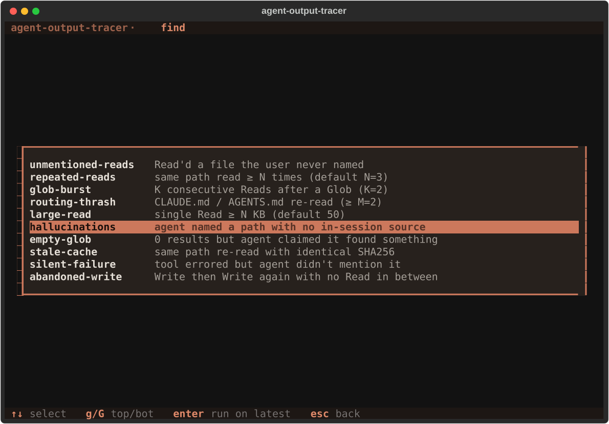
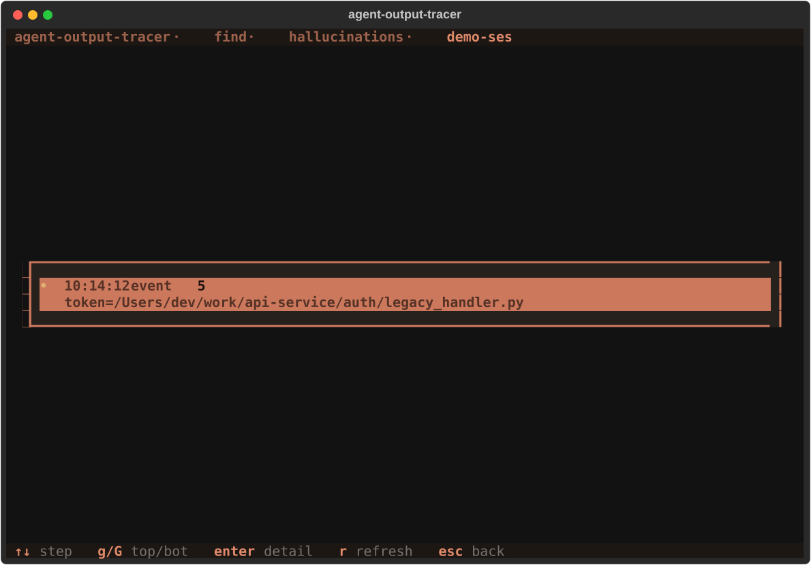
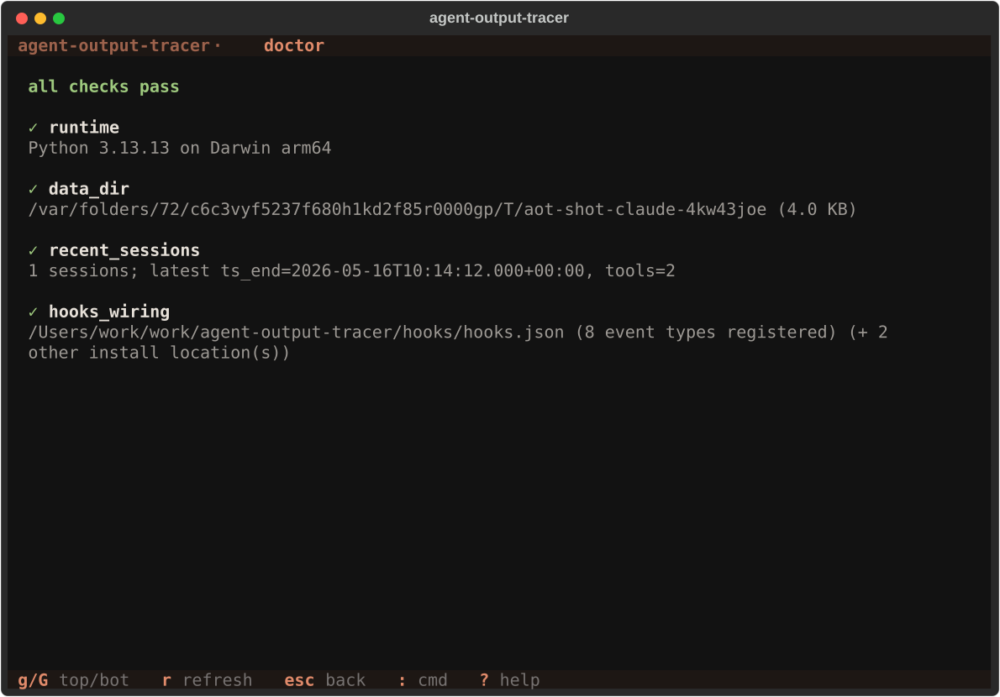

# `aot tui` — the side-channel inspector

The TUI is the project's primary surface. The CLI is the same query
engine wrapped for scripting; the TUI calls into it from a `textual`-
based forensic console designed for **half-desktop** layouts (~72 cols,
the realistic minimum for a terminal pane next to your agent's CLI).

This doc covers every screen, every keybind, and the systems that
underpin them (themes, sticky defaults, follow mode, clipboard yank).

---

## Launch

```bash
aot tui                          # latest captured session
aot tui --session <prefix>       # specific session
aot tui --session 2026-05-16     # date shorthand
```

The TUI auto-detects which engine you're inside:

1. If `--session <sid>` was given, the theme matches THAT session's
   engine (regardless of what the newest captured session is).
2. Otherwise the plugin-host env var wins: `CLAUDE_PLUGIN_DATA` →
   Claude theme (salmon), `CODEX_PLUGIN_DATA` → Codex theme (cyan).
3. Otherwise the newest captured session's engine.
4. Otherwise Codex (cyan plays well across terminal palettes).

`t` cycles the theme manually; once you've pressed `t` (or used the
Theme picker), the choice sticks for the rest of the run and Timeline
drilling no longer overrides it.

---

## Navigation model

The TUI is a screen stack:

```
Home  →  Sessions  →  Timeline  →  Event Detail
                                ↘
                                  (drill back with Esc)
Home  →  Find        Find → FindResults → Event Detail
Home  →  Trace       Trace → TraceResults
Home  →  Search      Search → SearchResults → Event Detail
Home  →  Stats / Doctor / Theme / Config
```

Every screen contributes one breadcrumb segment shown at the top
(`agent-output-tracer · sessions · 781ff3fa · timeline`). `Esc` pops
back one level. `Esc` on Home is a no-op (rather than crashing into an
empty default screen).

---

## Universal keybinds

| Key | Action |
|---|---|
| `↑` `↓` | Step through the focused list |
| `g` (or `Home`) | Jump to the first row / scroll top |
| `G` (or `End`) | Jump to the last row / scroll bottom |
| `Enter` | Open the highlighted item (drill in) |
| `Esc` | Back (drill out) |
| `:` | Command palette — type any command name to jump there |
| `?` (or `F1`) | Help overlay for the current screen + globals |
| `t` | Cycle theme: codex ↔ claude |
| `y` | Yank highlighted content to the system clipboard |
| `q` | Quit |

The help overlay (`?`) is the source of truth — it merges the current
screen's keybinds with the global ones above.

---

## Screens

### Home — function picker

<p align="center">
  
</p>

OhMyZsh-style banner identifies the app, the function picker exposes
the eight top-level screens, and a preview pane updates as the cursor
moves so you can see "what does this function do, what data will it
show, an example finding" before drilling in.

| Row | Drills into | Use |
|---|---|---|
| Sessions | SessionsScreen | Browse captures, decide which one to investigate |
| Find | FindScreen | Run one of ten anomaly detectors against a session |
| Trace | TraceScreen | "Where did this phrase come from?" — causal back-walk |
| Search | SearchScreen | Regex full-text search across every event field |
| Stats | StatsScreen | One-screen session metrics |
| Doctor | DoctorScreen | Self-diagnostic: is the recorder pipeline healthy? |
| Theme | ThemeScreen | Pick between Codex and Claude themes explicitly |
| Config | ConfigScreen | View / clear sticky defaults |

### Sessions — captures list

<p align="center">
  
</p>

Newest first, with a `●` marker on the most-recent capture. The preview
pane shows engine / span / cwd / event count / prompt mix / byte total /
top tools / top anomaly counters — all read straight from
`metadata.json`, no extra event-file scan per cursor step.

| Key | Action |
|---|---|
| `Enter` (or `T`) | Open this session's Timeline |
| `S` | Open Stats scoped to this session |
| `F` | Open Find vocab picker scoped to this session |
| `e` | Export this session (markdown / json / archive) |
| `r` | Refresh from disk |

### Timeline — event-by-event drill

<p align="center">
  
</p>

Two-line card per event:

```
›  19:42:06  user_prompt
   describe phase D — the plan and the layout we want

⏵  19:42:08  pre_tool · Read · .../DESIGN.md
   (47 KB)

✓  19:42:09  post_tool · Read
   # DESIGN  ## §4 layout — Phase D…

•  19:42:12  agent_response
   Phase D ships across four sub-phases; the canonical reference …
```

Semantic prefixes (cited from openai/codex `tui/src/`):

| Glyph | Event |
|:---:|---|
| `›`  | user_prompt — operator said something |
| `⏵`  | pre_tool — agent is about to call a tool |
| `✓`  | post_tool — tool returned |
| `•`  | agent_response — agent emitted its reply |
| `─`  | session_start / session_end / compact_pre / compact_post |

The accent (cyan / salmon) follows the active theme, but green ✓ and
muted dim greys for session markers stay semantic.

| Key | Action |
|---|---|
| `Enter` | Open the highlighted event's full detail |
| `o` | Toggle live follow (tail -f) |
| `r` | Refresh from disk |
| `y` | Yank the highlighted row's text |

#### Follow mode (`o`)

- Cursor snaps to the *newest* row after every poll (`tail -f`).
- StatusBar shimmers `●` ↔ `○` every 700 ms while polling.
- Poll interval is 200 ms — well within the floor where `stat()` cost
  starts to outpace what an operator can use.
- Drilling away or quitting kills the polling thread (no file-handle leak).

In manual mode (no follow), the cursor stays on the same event id
across reloads. If the event is no longer in view (e.g. search filter
hid it), the cursor falls back to the same row index. It never resets
to row 0 on reload.

### Event Detail

<p align="center">
  
</p>

Scrollable structured view: ts, event_type, tool name / input, paths,
tool response (or agent_response_text), bytes, plus the raw engine
payload preserved verbatim under `raw_event`.

| Key | Action |
|---|---|
| `j` / `k` | Scroll down / up |
| `r` | Toggle raw_event display |
| `s` | Toggle sanitised view (redacted bodies) |
| `n` | Attach a note to this event |
| `y` | Yank the structured event as pretty JSON |

### Find — anomaly detectors

<p align="center">
  
</p>

Ten anomaly vocabularies, each with a CLI-mirrored default threshold:

| Vocab | What it surfaces | Default |
|---|---|---|
| `hallucinations` | Agent named a path with no in-session source | – |
| `unmentioned-reads` | Read'd a file the user never named | – |
| `repeated-reads` | Same path read ≥ N times | N=3 |
| `glob-burst` | K consecutive Reads after a Glob | K=2 |
| `routing-thrash` | CLAUDE.md / AGENTS.md re-read ≥ M times | M=2 |
| `large-read` | Single Read ≥ N KB | N=50 |
| `empty-glob` | 0 results but agent claimed a hit | – |
| `stale-cache` | Same path re-read with identical SHA-256 | – |
| `silent-failure` | Tool errored but agent didn't mention it | – |
| `abandoned-write` | Write then Write again with no Read in between | – |

The picker pre-highlights the last vocab you ran (sticky default).
Override the threshold from the command palette: `:find repeated-reads 5`.

<p align="center">
  
</p>

Each match is one card: timestamp, event index, and the offending
token / path / tool / count. Enter on a match drills into the source
event.

### Trace — causal back-walk

```
Phrase to trace back to its source:
> hooks_wiring
```

Given a phrase the agent emitted, `query.trace` walks the event log
backward to find the first event that introduced it, then classifies
every prior Read by whether its `tool_response` contains the phrase.

The result card shows:

```
First mention
  ts:   19:42:12
  body: Phase D ships across four sub-phases; …

Last user prompt before
  ✓ mentioned   at 19:42:01
  describe phase D — the plan and the layout we want

Reads before
  [19:42:03] .../DESIGN.md  ✓ contains
  [19:38:55] .../README.md  ✗ does not contain
```

A `⚠ hallucination candidate` banner appears when neither a user
prompt nor any Read response grounded the phrase before the agent
said it.

### Search — regex full-text

```
Regex to search across event fields (latest session):
> JWT|token
```

Walks the same fields `query.grep` searches (user prompts, tool input,
tool response, agent response, command). Each match is one card:
`event-type.field · event N · 120-char preview`. Sticky default
pre-fills the input with your last query.

### Stats — session metrics

One-screen card with section headings:

```
Session  drill-001
Engine   claude-code  v1.2.3
Period   19:42 → 19:48

Events   42
Prompts  3 user · 4 agent
Tools    Read 12 · Bash 3 · Edit 1
Files    8 unique · 47.3 KB read

Anomalies
  hallucinations        2
  silent-failure        1

Tokens
  input                 18,420
  output                4,118
  cache_read            12,001
```

### Doctor — recorder self-diagnostic

<p align="center">
  
</p>

Four checks against the recorder pipeline, each labelled `✓` / `⚠` /
`✗` against the active theme's success / warning / error palette:

| Check | Confirms |
|---|---|
| `runtime` | Python version + platform |
| `data_dir` | `${CLAUDE_PLUGIN_DATA}` resolves and exists |
| `recent_sessions` | At least one session has been captured |
| `hooks_wiring` | `hooks.json` is present at the right install location |

If any check fails, the `fix:` hint tells you what to do.

### Theme picker

`●` next to the active theme. Enter applies and pops back to Home.
The `t` cycle from any screen does the same thing without leaving
the screen you were on.

### Config viewer

Read-only display of `~/.config/aot/config.toml`. Shows the sticky
defaults (last Find vocab, Trace phrase, Search regex, Export
format / safe-share / excerpt) plus the active theme.

| Key | Action |
|---|---|
| `c` | Clear the `[history]` section (next launch starts fresh) |
| `r` | Re-read config from disk |

---

## Systems

### Themes

Two custom Textual themes, registered at app mount:

| Theme | Accent | Heritage |
|---|---|---|
| `aot-codex` | `#00d7d7` cyan | source-cited from `openai/codex` (`tui/src/style.rs:44` uses `Color::Cyan + BOLD` as primary accent) |
| `aot-claude` | `#e08a6a` salmon | β-flavoured from Anthropic's brand `#CC785C` — Claude Code has no public colour spec, so this is an inspired approximation |

Each theme defines its own `success` / `warning` / `error` slots, so
the Doctor ✓ / ⚠ / ✗ icons, Find / Search match bullets, the
StatusBar live-follow shimmer, and every error toast tint to match
the active palette. No "Codex cyan" leaks onto Claude, no Claude
salmon leaks onto Codex.

Auto-detect rules are documented in the [Launch](#launch) section.

### Sticky defaults

Inputs persist to `~/.config/aot/config.toml` (honours
`$XDG_CONFIG_HOME` and `$AOT_CONFIG_HOME`):

| Persisted | Pre-fills on |
|---|---|
| `find_vocab` | FindScreen vocab picker |
| `trace_phrase` | TraceScreen input |
| `search_regex` | SearchScreen input |
| `export_format` / `export_safe_share` / `export_excerpt` | Export modal |

Theme is **not** persisted — auto-detect runs fresh on every launch
so the TUI follows whichever engine you're in. `t` remains a
per-session override.

### Clipboard yank

`y` on any screen copies the screen's payload to the system clipboard
via the platform tool (`pbcopy` on macOS, `xclip` / `xsel` / `wl-copy`
on Linux, `clip` on Windows). Each screen decides what "payload" means:

- EventDetail → the event as pretty-printed JSON
- Stats / Doctor → the rendered body text
- Timeline / Sessions / Find / Search → the highlighted row

A toast confirms success (`yanked N chars to clipboard`) or surfaces
the failure mode (`clipboard tool not found`).

Native terminal text selection (Option-drag on macOS terminals,
Shift-drag on Linux) is unaffected — useful for picking a partial
substring out of a longer event body.

### Status bar

Persistent at the bottom of every screen:

```
claude-code  ·  drill-001  ·  events=42  ·  ● live  ·  19:42
```

The engine name uses the active accent. The `live` segment shimmers
between `●` (bright) and `○` (dim) when Timeline follow is on.

### Command palette (`:`)

Type any screen name or shortcut to jump there from anywhere:

```
:doctor             → DoctorScreen
:stats              → StatsScreen for latest session
:find hallucinations         → FindResultsScreen for latest, vocab pre-set
:find repeated-reads 5       → same with threshold override
:trace hooks_wiring          → TraceResultsScreen
:search "JWT|token"          → SearchResultsScreen
```

---

## Half-desktop optimisation

The TUI targets **~72 column** layouts (a terminal pane next to your
agent's CLI):

- Tabular screens use 2-line vertical cards, not multi-column tables.
- Long absolute paths render as `.../parent/basename`.
- Event Detail body text auto-wraps; the structured payload is the
  primary surface, not the raw event.
- All chrome (Breadcrumb, FooterHints, StatusBar) is a single row.

Regression tests assert no horizontal scrollbar appears on the
primary screens at 72 cols × 24 rows.

---

## Troubleshooting

| Symptom | Likely cause | Fix |
|---|---|---|
| `aot tui` exits with `[tui] textual not installed` | The `[tui]` extra wasn't installed | `pipx install "agent-output-tracer[tui]"` or `pipx inject agent-output-tracer textual watchdog` |
| Wrong theme on launch | Stale metadata.engine on pre-v0.16.1 sessions used to force the wrong theme; fixed in v0.16.2 by reading engine from the event stream | Upgrade to ≥ v0.16.2; if needed, press `t` |
| `?` doesn't open the help overlay | Some terminal / IME combinations intercept the literal `?` | Press `F1` instead |
| `y` says "clipboard tool not found" | No platform clipboard tool on PATH | Install `pbcopy` / `xclip` / `xsel` / `wl-copy` / `clip` |
| Mouse selection doesn't work | The TUI captures mouse for click handling | Hold Option (macOS) or Shift (Linux) while dragging |

For recorder-pipeline issues (no sessions captured, hooks not firing),
run `aot doctor` or open Doctor in the TUI — every check has a `fix:`
hint when it fails.
